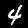
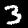

# Prepare your code for submitting a training job

To be able to submit a training session using *AIMed*'s training engine, we have to define five components for a training session: `DataLoader`, `Augmentor` (optional), `Preprocessor`, `ModelBuilder` and `Evaluator`. Orchestrator will instantiate these components using a config file, and pass them to `TFKerasTrainer` to which will take care of training (resume interrupted training session), logging (`tensorboard` and `mlflow`), exporting (to `SavedModel` format) and checkpointing. Orchestrator will pass the exported model to `Evaluator` which is responsible for evaluation on test and validation data. `Evaluator` will generate detailed `.csv` report files for error analysis, these reports contain metric values for each data-point. Here's the sequence diagram: [training pipeline](https://miro.com/app/board/o9J_lmFWJy8=/?invite_link_id=789107961780).

We will go through an example, in which we will train and evaluate a classifier for `mnist` dataset. Code is available [here](https://github.com/iamsoroush/mnist-test.git).

---
**Note**

try in yourself: [notebook](https://colab.research.google.com/drive/1hNinB5b8qNNyt6UzWeDYDNGBA0G36VVK?usp=sharing)

---

Install `abstractions` package:

```shell
pip install abstractions-aimedic
```

## Generate Data

Let's create a well-structered mnist dataset. This code snippet will generate a dataset structered as follow:

```
datasets/
    mnist/
        train/
            imgage_0.jpg
            imgage_1.jpg
            .
            .
            labels.txt -> pd.DataFrame({'image name': [...], 'label': [...]})
        validation/
        test/


```python
import tensorflow as tf
import tensorflow.keras as tfk

import skimage.io
import pathlib
import pandas as pd


(train_images, train_labels), (test_images, test_labels) = tfk.datasets.mnist.load_data()

train_images = train_images[:1000]
test_images = test_images[:1000]

train_labels = train_labels[:1000]
test_labels = test_labels[:1000]

def write_images(images, labels_list, img_dir):
    labels = {}
    for i, (img, l) in enumerate(zip(images, labels_list)):
        img_name = f'image_{i}.jpg'
        skimage.io.imsave(img_dir.joinpath(img_name), img)
        labels[img_name] = l

    names = list(labels.keys())
    labels = list(labels.values())

    pd.DataFrame({'image name': names, 'label': labels}).to_csv(img_dir.joinpath('labels.csv'))

data_dir = pathlib.Path('datasets').joinpath('mnist')
data_dir.mkdir(parents=True, exist_ok=True)

train_img_dir = data_dir.joinpath('train')
train_img_dir.mkdir(exist_ok=True)
write_images(train_images, train_labels, train_img_dir)

val_img_dir = data_dir.joinpath('validation')
val_img_dir.mkdir(exist_ok=True)
write_images(test_images[:500], test_labels[:500], val_img_dir)

test_img_dir = data_dir.joinpath('test')
test_img_dir.mkdir(exist_ok=True)
write_images(test_images[500:], test_labels[500:], test_img_dir)

```

    Downloading data from https://storage.googleapis.com/tensorflow/tf-keras-datasets/mnist.npz
    11493376/11490434 [==============================] - 0s 0us/step
    11501568/11490434 [==============================] - 0s 0us/step


## Define your model

Know let's define the objective. We have a dataset of `RGB(0, 255)` with `shape(28, 28, 3)`, and we want to train a model that classifies input images to one of `(0, 1, 2, 3, 4, 5, 6, 7, 8, 9)` classes.

We will define the model, optimizer, loss, training-time-metrics and any other stuff that is necessary to pass a compiled, ready-to-fit model to orchestrator.

We need to define the `get_compiled_model` method of our `ModelBuilder` which is sub-classed from `abstractions.ModelBuilderBase`. Take a look at [this](https://abstractions.readthedocs.io/en/latest/apidoc/abstractions.html#module-abstractions.model_builder) for more info.

Let's define the `ModelBuilder` inside `models.py` module:


```python
import tensorflow.keras as tfk
import tensorflow as tf

from abstractions import ModelBuilderBase


class ModelBuilder(ModelBuilderBase):
    def get_compiled_model(self):
        model = tfk.models.Sequential([
            tfk.layers.Dense(self.n_filters, activation=self.activation, input_shape=(self.input_h * self.input_w,)),
            tfk.layers.Dropout(self.dropout_rate),
            tfk.layers.Dense(10, activation='softmax')
        ])

        model.compile(optimizer='adam',
                      loss=tf.losses.SparseCategoricalCrossentropy(from_logits=True),
                      metrics=[tf.metrics.SparseCategoricalAccuracy()])

        return model

    def _load_params(self, config):
        m_config = config.model_builder
        self.activation = m_config.activation
        self.n_filters = m_config.n_filters
        self.dropout_rate = m_config.dropout_rate
        self.input_h = config.input_height
        self.input_w = config.input_width

    def _set_defaults(self):
        self.activation = 'relu'
        self.n_filters = 512
        self.dropout_rate = 0.2
        self.input_h = 28
        self.input_w = 28
```

Note that every class which is sub-classed from `abstractions.BaseClass` must define `_load_params` and `_set_defaults` methods. All of your class parameters has to be difned here. You should define your parameters' default values in `_set_defaults` method, and load the same paramters from config file in `_load_params`. This way, you can be clear about what could be modified inside your class, and you can use this class with `config=None` in exploration phase.

Let's see what are the inpput-output signatures of the model:


```python
model_builder = ModelBuilder(None)
model = model_builder.get_compiled_model()

print(f'inputs: {model.inputs}')
print(f'outputs: {model.outputs}')
```

    inputs: [<KerasTensor: shape=(None, 784) dtype=float32 (created by layer 'dense_2_input')>]
    outputs: [<KerasTensor: shape=(None, 10) dtype=float32 (created by layer 'dense_3')>]


So we need to design our data-pipeline in a way that will generate batches of data compatible with this input-output. Also, we have to take this into account when we are desigining metric functions for our `Evaluator`, functions that expect an array with `shape(10,)` as `y_true` and `y_pred`.

## Define your data pipeline: `DataLoader`, `Augmentor`, `Preprocessor`

Define `DataLoader`, `Augmentor` and `Preprocessr` by sub-classing `abstractions.DataLoaderBase`, `abstractions.AugmentorBase` and `abstractions.PreprocessorBase`.
We will do that in two different ways,
1. using `tf.data.Dataset` and,
2. vanilla Python generator

### `tf.data.Dataset`


By subclassing from `abstractions.DataLoaderBase`, we have to define three abstract methods `create_training_generator`, `create_validation_generator` and `create_test_generator`, and optionally override `get_validation_index`. Take a look at [code's API](https://abstractions.readthedocs.io/en/latest/apidoc/abstractions.html#module-abstractions.data_loader) for more info.

Inside `dataset.py` module, lets define our `DataLoaderTF` class:


```python
from abstractions import DataLoaderBase


class DataLoaderTF(DataLoaderBase):

    def __init__(self, config, data_dir):
        super().__init__(config, data_dir)

        self.train_data_dir = self.data_dir.joinpath('train')
        self.val_data_dir = self.data_dir.joinpath('validation')
        self.test_data_dir = self.data_dir.joinpath('test')

    @staticmethod
    def _read_labels_df(data_dir: pathlib.Path):
        labels_df = pd.read_csv(data_dir.joinpath('labels.csv'))
        labels_df['path'] = labels_df.apply(lambda x: str(data_dir.joinpath(x['image name'])), axis=1)
        return labels_df

    def create_training_generator(self):
        labels_df = self._read_labels_df(self.train_data_dir)
        n_data = len(labels_df)

        img_paths = tf.data.Dataset.from_tensor_slices(labels_df['path'])
        images = img_paths.map(self._read_image_tf)
        labels = tf.data.Dataset.from_tensor_slices(labels_df['label'])
        weights = tf.data.Dataset.from_tensor_slices(tf.ones(n_data))

        train_ds = tf.data.Dataset.zip((images, labels, weights))
        if self.shuffle:
            train_ds = train_ds.shuffle(n_data)

        return train_ds, n_data

    def create_validation_generator(self):
        labels_df = self._read_labels_df(self.val_data_dir)
        n_data = len(labels_df)

        img_paths = tf.data.Dataset.from_tensor_slices(labels_df['path'])
        images = img_paths.map(self._read_image_tf)
        labels = tf.data.Dataset.from_tensor_slices(labels_df['label'])
        weights = tf.data.Dataset.from_tensor_slices(tf.ones(n_data))

        ds = tf.data.Dataset.zip((images, labels, weights))

        return ds, n_data

    def create_test_generator(self):
        labels_df = self._read_labels_df(self.test_data_dir)
        n_data = len(labels_df)

        img_paths = tf.data.Dataset.from_tensor_slices(labels_df['path'])
        images = img_paths.map(self._read_image_tf)
        labels = tf.data.Dataset.from_tensor_slices(labels_df['label'])
        data_ids = tf.data.Dataset.from_tensor_slices(labels_df['image name'])

        ds = tf.data.Dataset.zip((images, labels, data_ids))

        return ds, n_data
    
    def get_validation_index(self):
        return self._read_labels_df(self.val_data_dir)['image name'].values

    def _load_params(self, config):
        self.shuffle = config.data_loader.shuffle

    def _set_defaults(self):
        self.shuffle = True

    @staticmethod
    def _read_image_tf(path):
        return tf.image.decode_jpeg(tf.io.read_file(path))
```

Let's check the output of the train-data-generator:


```python
from google.colab.patches import cv2_imshow

dl = DataLoaderTF(None, data_dir)
train_ds, train_n = dl.create_training_generator()
val_ds, val_n = dl.create_validation_generator()

train_gen = train_ds.as_numpy_iterator()
data_point = next(train_gen)

image, label, sample_weight = data_point

cv2_imshow(image)
print(f'label: {label}')
print(f'sample weight: {sample_weight}')
```


    

    


    label: 4
    sample weight: 1.0


And the output of test-data-generator:


```python
test_ds, test_n = dl.create_test_generator()

test_gen = test_ds.as_numpy_iterator()
data_point = next(test_gen)

image, label, data_id = data_point

cv2_imshow(image)
print(f'label: {label}')
print(f'data id: {data_id}')
```


    

    


    label: 3
    data id: b'image_0.jpg'


Note that shuffling is done only for training data generator.

Next, we will define our preprocessing logic inside `Preprocessor` module. Note that we don't have any augmentor's here, you can get more info about `Augmentor` [here](https://abstractions.readthedocs.io/en/latest/apidoc/abstractions.html#module-abstractions.augmentor).

By sub-classing `PreprocessorBase`, we must define
- `image_preprocess`
- `label_preprocess`
- `add_image_preprocess`
- `add_label_preprocess`
- `batchify`

Under the hood, orchestrator will try to call `add_preprocess` method of `Preprocessor`:

```python
gen = self.add_image_preprocess(generator)
gen = self.add_label_preprocess(gen)
gen, n_iter = self.batchify(gen, n_data_points)
return gen, n_iter
```

In rare cases that your preprocessing pipeline does not fit into this design, you can simply override `add_preprocess` method. Take a look at `Preprocessor` 's [API](https://abstractions.readthedocs.io/en/latest/apidoc/abstractions.html#module-abstractions.preprocessor).

Let's define our `Preprocessor` inside `preprocessing.py` module:


```python
from abstractions import PreprocessorBase
from abstractions.utils import ConfigStruct

class PreprocessorTF(PreprocessorBase):
    def image_preprocess(self, image):
        return tf.reshape(image, (self.input_h * self.input_w,)) / self.normalize_by

    def _wrapper_image_preprocess(self, x, y, w):
        pre_processed = self.image_preprocess(x)
        return pre_processed, y, w

    def label_preprocess(self, label):
        return label

    def add_image_preprocess(self, generator):
        return generator.map(self._wrapper_image_preprocess)

    def add_label_preprocess(self, generator):
        return generator

    def batchify(self, generator, n_data_points):
        gen = generator.batch(self.batch_size).repeat()
        n_iter = n_data_points // self.batch_size + int((n_data_points % self.batch_size) > 0)
        return gen, n_iter

    def _load_params(self, config: ConfigStruct):
        self.normalize_by = config.preprocessor.normalize_by
        self.input_h = config.input_height
        self.input_w = config.input_width
        self.batch_size = config.batch_size

    def _set_defaults(self):
        self.normalize_by = 255
        self.input_h = 28
        self.input_w = 28
        self.batch_size = 8
```

Note that we are repeating the dataset right after batching. This way we can be sure about having all data in each epoch.

Let's look at the output of preprocessor:


```python
preprocessor = PreprocessorTF(None)

train_data_gen, n_iter_train = preprocessor.add_preprocess(train_ds, train_n)
val_data_gen, n_iter_val = preprocessor.add_preprocess(val_ds, val_n)

train_gen = train_data_gen.as_numpy_iterator()

batch = next(train_gen)

print(f'x batch shape: {batch[0].shape}')
print(f'y batch shape: {batch[1].shape}')
print(f'w batch shape: {batch[2].shape}')
```

    x batch shape: (8, 784)
    y batch shape: (8,)
    w batch shape: (8,)


Our data pipeline is ready, and the output of `preprocessor.add_preprocess` can be used for training the model.

### Python Data Generator

By subclassing from `abstractions.DataLoaderBase`, we have to define three abstract methods `create_training_generator`, `create_validation_generator` and `create_test_generator`, and optionally override `get_validation_index`. Take a look at [code's API](https://abstractions.readthedocs.io/en/latest/apidoc/abstractions.html#module-abstractions.data_loader) for more info.

Inside `dataset.py` module, lets define our `DataLoader` class:


```python
import numpy as np
import tensorflow as tf
import skimage.io
import pandas as pd

from abstractions import DataLoaderBase


class DataLoader(DataLoaderBase):

    def __init__(self, config, data_dir):
        super().__init__(config, data_dir)

        self.train_data_dir = self.data_dir.joinpath('train')
        self.val_data_dir = self.data_dir.joinpath('validation')
        self.test_data_dir = self.data_dir.joinpath('test')

    def create_training_generator(self):
        labels_df = self._read_labels_df(self.train_data_dir)
        n_data = len(labels_df)

        gen = self._generator(labels_df['path'], labels_df['label'], self.shuffle)
        return gen, n_data

    def create_validation_generator(self):
        labels_df = self._read_labels_df(self.val_data_dir)
        n_data = len(labels_df)

        gen = self._generator(labels_df['path'], labels_df['label'], False)
        return gen, n_data

    def create_test_generator(self):
        labels_df = self._read_labels_df(self.test_data_dir)
        n_data = len(labels_df)

        gen = self._test_gen(labels_df['path'], labels_df['label'], labels_df['image name'])
        return gen, n_data

    def get_validation_index(self):
        return self._read_labels_df(self.val_data_dir)['image name'].values

    @staticmethod
    def _read_labels_df(data_dir: pathlib.Path):
        labels_df = pd.read_csv(data_dir.joinpath('labels.csv'))
        labels_df['path'] = labels_df.apply(lambda x: str(data_dir.joinpath(x['image name'])), axis=1)
        return labels_df

    def _load_params(self, config):
        self.shuffle = config.data_loader.shuffle

    def _set_defaults(self):
        self.shuffle = True

    @staticmethod
    def _read_image(path):
        """returns (28, 28)"""
        return skimage.io.imread(path, as_gray=True)

    def _generator(self, image_paths, label_array, shuffle):
        indxs = np.arange(len(image_paths))
        while True:
            if shuffle:
                np.random.shuffle(indxs)
            for ind in indxs:
                image = self._read_image(image_paths[ind])
                yield image, label_array[ind], 1

    def _test_gen(self, image_paths, label_array, data_ids):
        for img_path, label, data_id in zip(image_paths, label_array, data_ids):
            image = self._read_image(img_path)
            yield image, label, data_id 

```

Let's check the output of the train-data-generator:


```python
from google.colab.patches import cv2_imshow

dl = DataLoader(None, data_dir)
train_gen, train_n = dl.create_training_generator()
val_gen, val_n = dl.create_validation_generator()

data_point = next(train_gen)

image, label, sample_weight = data_point

cv2_imshow(image)
print(f'label: {label}')
print(f'sample weight: {sample_weight}')
```


    

    


    label: 7
    sample weight: 1


And the output of test-data-generator:


```python
test_gen, test_n = dl.create_test_generator()

data_point = next(test_gen)

image, label, data_id = data_point

cv2_imshow(image)
print(f'label: {label}')
print(f'data id: {data_id}')
```


    

    


    label: 3
    data id: image_0.jpg


Note that shuffling is done only for training data generator.

Next, we will define our preprocessing logic inside `Preprocessor` module. Note that we don't have any augmentor's here, you can get more info about `Augmentor` [here](https://abstractions.readthedocs.io/en/latest/apidoc/abstractions.html#module-abstractions.augmentor).

By sub-classing `PreprocessorBase`, we must define
- `image_preprocess`
- `label_preprocess`
- `add_image_preprocess`
- `add_label_preprocess`
- `batchify`

Under the hood, orchestrator will try to call `add_preprocess` method of `Preprocessor`:

```python
gen = self.add_image_preprocess(generator)
gen = self.add_label_preprocess(gen)
gen, n_iter = self.batchify(gen, n_data_points)
return gen, n_iter
```

In rare cases that your preprocessing pipeline does not fit into this design, you can simply override `add_preprocess` method. Take a look at `Preprocessor` 's [API](https://abstractions.readthedocs.io/en/latest/apidoc/abstractions.html#module-abstractions.preprocessor).

Let's define our `Preprocessor` inside `preprocessing.py` module:


```python
from abstractions import PreprocessorBase


class Preprocessor(PreprocessorBase):

    def image_preprocess(self, image):
        return np.reshape(image, (self.input_h * self.input_w)) / self.normalize_by

    def label_preprocess(self, label):
        return label

    def add_image_preprocess(self, generator):
        while True:
            x, y, w = next(generator)
            yield self.image_preprocess(x), y, w

    def add_label_preprocess(self, generator):
        while True:
            x, y, w = next(generator)
            yield x, self.label_preprocess(y), w
        # return generator

    def batchify(self, generator, n_data_points):
        n_iter = n_data_points // self.batch_size + int((n_data_points % self.batch_size) > 0)
        gen = self._batch_gen(generator, self.batch_size)
        return gen, n_iter

    @staticmethod
    def _batch_gen(generator, batch_size):
        while True:
            x_b, y_b, z_b = list(), list(), list()
            for i in range(batch_size):
                x, y, z = next(generator)
                x_b.append(x)
                y_b.append(y)
                z_b.append(z)
            yield np.array(x_b), np.array(y_b), np.array(z_b)

    def _load_params(self, config: ConfigStruct):
        self.normalize_by = config.preprocessor.normalize_by
        self.input_h = config.input_height
        self.input_w = config.input_width
        self.batch_size = config.batch_size

    def _set_defaults(self):
        self.normalize_by = 255
        self.input_h = 28
        self.input_w = 28
        self.batch_size = 8

```

Let's look at the output of preprocessor:


```python
preprocessor = Preprocessor(None)

train_data_gen, n_iter_train = preprocessor.add_preprocess(train_gen, train_n)
val_data_gen, n_iter_val = preprocessor.add_preprocess(val_gen, val_n)

batch = next(train_data_gen)

print(f'x batch shape: {batch[0].shape}')
print(f'y batch shape: {batch[1].shape}')
print(f'w batch shape: {batch[2].shape}')
```

    x batch shape: (8, 784)
    y batch shape: (8,)
    w batch shape: (8,)


## Define evaluator functions

For evaluating the model, orchestrator uses `Evaluator` and generates detailed report about the model and the test and validation data.

We have to define one method: `get_eval_funcs`. This method must return a dictionary which is a mapping from function names to function objects. Evaluator will call every function in this dictionary like this `function(y_true, y_pred)`. Note that `y_true` and `y_pred` are not batches, and in our case will be a tensor of `shape(10,)`.

Let's define the evaluator inside the `evaluation.py` module:


```python
from abstractions import EvaluatorBase


class Evaluator(EvaluatorBase):
    def get_eval_funcs(self):
        return {'sparse categorical ce': self.get_cat_loss()}

    def get_cat_loss(self, from_logits=False):

        def scce_loss(y_true, y_pred):
            scce = tfk.losses.SparseCategoricalCrossentropy(from_logits=from_logits)
            return scce(y_true, y_pred).numpy()

        return scce_loss
```

## Define your `config.yaml`

Now, we have to define the config file. This file will contain any parameters that determine the state of the components, i.e. attributes of each of our classes.

Your config file should follow a convention:

- `input_height`: 28
- `input_width`: 28
- `src_code_path`: 'src' # required, this is where your code  in your repository
- `data_loader_class`: 'dataset.DataLoaderTF' # required
- `preprocessor_class`: 'preprocessing.PreprocessorTF' # required
- `model_builder_class`: 'models.ModelBuilder' # required
- `evaluator_class`: 'evaluator_class: evaluation.Evaluator' # required
- `epochs`: 10 # required
- `batch_size`: 8 # required

- `data_loader`:
    - `shuffle`: True # on training data

- `model_builder`:
    - `name`: "baseline-unet"
    - `activation`: 'relu'
    - `n_filters`: 512
    - `dropout_rate`: 0.2

- `preprocessor`:
    - `normalize_by`: 255

- `export`: # required
    - `metric`: "val_loss"
    - `mode`: "min"

- `project_name`: 'mnist' # required, will be used as mlflow's experiment_name


Put your config at `repo_root/runs/run_name`, push your code, and now you can request for a training session.
